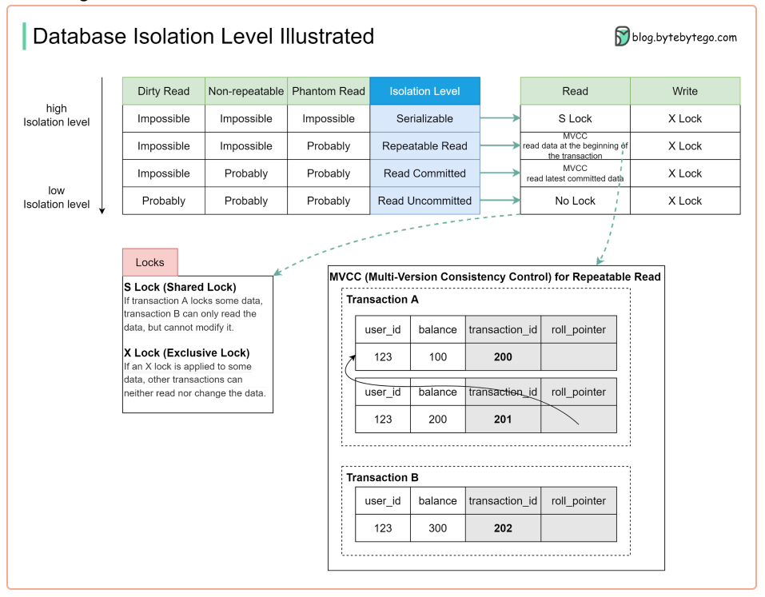

# Interview process at a startup

*These questions were collected by a lead-backend engineer who did the hiring at a gaming startup. I was asked several of these including the coding challenges.*

*A lot of the answers I generated with Chat-GPT (pronounce: chat gipitty) Not mindlessly might I add, but still use it with caution.*

- [Interview Process](#interview-process-adaptive)
- [Warmup](#cracking-the-egg)
- [Coding excercise](#show-us-what-you-got)
- [Theory](#do-you-know)

## Interview process (adaptive)
The following interview questionnaire is created to adaptively assign questions for the candidate. The topics order is followed by the actual conversation, so this documentation has to be considered as a guide only. The interview consists of three parts:
1. __Cracking the Egg (warmup):__ First we aim to guide the candidate to a little more relaxed state as it’ll help during the whole process.
2. __Show us what you got! (coding excerise) :__ In the second part we give the candidate one or two short algorithms to implement where we can track the
thread of thought.
3. __Do you know…? (theory) :__ Lastly we bombard the candidate with several theoretical and lexical questions trying to find the boundaries in various topics.

## Cracking the Egg
__Describe your typical work day!__

__If you’d have infinite resources, how would you improve your last assignment tasks?__

__What do you consider your biggest achievement?__

__How do you inform yourself about the latest technologies? / How do you educate yourself?__

__How would you describe the SDLC you have been working with? What would be the ideal one?__

__Which methodology have you been working with?__

<br>

__What are the main points of a Waterfall methodology?__

Waterfall methodology is often used for large, well-defined projcts with a clear set of requirements. The process is characterized by its linear, sequential flow, with each stage building upon the previous one, and with little or no overlap between stages. The key advantage of Waterfall is its predictability, making it ideal for projects where the requirements are well understood and unlikely to change.
- Requirements gathering and analysis: This stage involves gathering the requirements for the software from stakeholders and analyzing the information to determine what the software needs to do.
- Design: This stage involves creating a detailed design for the software, including architectural design, interface design, and database design.
- Implementation: This stage involves writing code and building the software based on the design.
Testing: This stage involves testing the software to ensure it meets the requirements and fixing any bugs or issues found during testing.
- Deployment: This stage involves deploying the software to a production environment, where it can be used by end-users.
Maintenance: This stage involves maintaining and updating the software to fix bugs and add new features.

__What does Agile mean to you?__

Agile emphasizes the flexibility and adaptability of software development processes, allowing teams to respond quickly to changes in requirements or market conditions. Agile is a response to the rigid, prescriptive approaches of traditional software development methodologies, such as Waterfall. It is based on the Agile Manifesto, which outlines a set of principles for software development that prioritize delivering value to customers and embracing change. Agile approaches include Scrum, Kanban, and Lean. Agile methodologies are used to build software in an iterative, incremental manner, with a focus on continuous improvement and collaboration between team members.

__Which Agile methodology have you met?__
Kanban, Scrum

__How would you organise a KANBAN/SCRUM development?__

Scrum
- Form a cross-functional team: Assemble a team with all the skills needed to complete a project, including developers, designers, and testers.
- Prioritize a backlog: Create a prioritized list of tasks, called a backlog, that the team will work on.
- Plan sprints: Plan short, iterative development cycles, called sprints, to deliver working software incrementally.
- Hold daily stand-up meetings: Hold daily stand-up meetings to discuss progress, identify obstacles, and coordinate work.
- Review and adjust the process: After each sprint, review the progress made and make adjustments to the process as needed to ensure continuous improvement.

Kanban

- Visualize the workflow: Create a visual representation of the work process, such as a whiteboard or digital board, to show the flow of work from start to finish.
- Limit work in progress: Set limits on the number of tasks that can be worked on simultaneously to prevent bottlenecks and increase focus.
- Manage flow: Monitor the flow of work and make adjustments as needed to keep the process running smoothly.
- Make process policies explicit: Define the rules and policies for the process to ensure that everyone is working in a consistent and predictable manner.
- Implement feedback loops: Encourage feedback from team members and stakeholders to continuously improve the process.


__What kind of version control systems have you been working with?__
GIT

__What is the difference between Git and TFS?__

Git is a version control technology that enables you to version your codebases with the opportunity to revert, merge code.
TFS stands for Team Foundation Server is a code repository with version control and the ability to track code changes, an integrated CI/CD tool, that builds and deploys your code and provides project management tools to be able to manage any software development task.


- Centralized vs Distributed: TFS is a centralized version control system, meaning that there is a single source of truth, or "central repository" that all team members check code into and get updates from. Git, on the other hand, is a distributed version control system, where each developer's local repository contains the entire history of the project, allowing for offline work and more flexible collaboration.
- Branching and Merging: Git has a more flexible branching and merging model compared to TFS. In Git, branching is cheap and easy, allowing developers to create multiple branches for different features, bug fixes, etc. TFS has a similar concept, but it is more heavyweight, requiring more steps and administrative privileges.

<br>


__What is the difference between a Merge and a Rebase?__


Merge

Combines multiple branch histories into one, resulting in a new merge commit. This method maintains a clear history of changes and is useful when working with multiple developers on the same code base.

Rebase

On the other hand, replays the changes from a branch onto another branch, resulting in a linear history. This method discards the original branch and its history and is useful when you want to integrate changes from one branch into another without creating a merge commit.

In general, a Merge is used for preserving history and collaboration, while a Rebase is used for creating a linear history and preserving a clean branch structure.

<br>

__While you are working on the code, how do you protect the already implemented functionalities?__

Code version control
- Use version control systems like Git to keep track of changes in the codebase, maintain a history of modifications, and easily revert to previous versions of the code.

Branching strategies
- Use branching strategies like GitFlow or Feature Branching to isolate new code changes and keep them separate from the main codebase. This prevents new changes from breaking existing functionalities.

Code reviews
- Have other team members review the code changes before they are merged into the main codebase. This ensures that new code changes meet the coding standards and do not break existing functionalities.

Automated testing
- Use automated testing tools like JUnit or TestNG to write test cases for new and existing functionalities. This helps to catch bugs and ensure that existing functionalities are not broken by new code changes.

Continuous Integration and Continuous Deployment (CI/CD)
- Implement a CI/CD pipeline to automatically build, test, and deploy code changes. This helps to catch bugs and ensure that new code changes do not break existing functionalities.

__What does a “unit“ mean for you, when you are working with Unit Tests?__

Defining a “unit” is a collective decision for the people, company or project owners which represents the smallest testable code section that needs to be tested. Some companies don’t write unit tests for every class/every function but only a larger piece of code. It can vary due to competency factors as well, a junior is more likely to test the smaller code section to make sure it works.

__Which Unit Test frameworks do you have experience with?__

XUnit - Home > xUnit.net

__How do you handle dependencies, when you’d like to isolate a logic?__

I don’t know
Using interfaces and Dependency injection

__What kind of mocking frameworks are you familiar with?__

Moq

__What is the main difference between a mock and a stub?__

__Stub:__ 
I believe the biggest distinction is that a stub you have already written with predetermined behavior. So you would have a class that implements the dependency (abstract class or interface most likely) you are faking for testing purposes and the methods would just be stubbed out with set responses. They would not do anything fancy and you would have already written the stubbed code for it outside of your test.

`initialise -> set expectations -> exercise -> verify pattern to testing`

```csharp
public class DatabaseStub : IDatabase
{
    public int GetData(string key)
    {
        return 42;
    }
}
```

__Mock:__ A mock is something that as part of your test you have to set up with your expectations. A mock is not set up in a predetermined way so you have code that does it in your test. Mocks in a way are determined at runtime since the code that sets the expectations has to run before they do anything.

`initialise -> exercise -> verify`

```csharp
using Moq;
using System;

namespace MoqExample
{
    class Program
    {
        static void Main(string[] args)
        {
            // Create the mock object
            var mockService = new Mock<IExampleService>();

            // Set up the mock object's behavior
            mockService.Setup(x => x.GetData(It.IsAny<int>()))
                       .Returns("Example Data");

            // Use the mock object in your code
            Console.WriteLine(mockService.Object.GetData(5));
        }
    }

    public interface IExampleService
    {
        string GetData(int id);
    }
}
```

__Similarity between Mocks and Stubs:__ The purpose of both is to eliminate testing all the dependencies of a class or function so your tests are more focused and simpler in what they are trying to prove.

__Have you heard the work “mockicist” before?__

__How would you interpret TDD/BDD? What are the differences?__

__What does FIRST mean? / What is a “good test“ for you?__

__What are the steps of a general testing? / Have you heard about the AAA testing? What does it mean?__

```csharp
// Arrange
var repository = Substitute.For<IClientRepository>();
var client = new Client(repository);

// Act
client.Count();

// Assert
mock.Assert.Equal(15);
```

__What is the test pyramid?__

The idea behind the Test Pyramid is that a well-structured test suite should have more unit tests, which are fast and inexpensive, than integration tests or end-to-end tests, which are slower and more complex. This approach helps to ensure that most of the bugs are caught early in the development process, reducing the cost of fixing them later in the development cycle.

__What do you mean about necessary coverage? What do we cover?__

__What scenarios would you create tests for?__

__What is the difference between an Edge Case and a Corner Case?__

__Edge Case:__ An edge case is a test case that tests the boundaries or limits of the system. Edge cases usually occur at the extremes of the input or output range and are used to verify that the system can handle unexpected inputs or outputs. For example, if the system is designed to handle a range of 1 to 10, an edge case test would be to check the system's behaviour when inputting 0 (the lower limit) or 11 (the upper limit).
__Corner Case:__ A corner case is a more severe version of an edge case, and it refers to a test case that tests the system's behaviour when multiple boundaries or limits are hit simultaneously. Corner cases are used to verify the system's behaviour when the input or output is at its maximum or minimum and the system's normal behaviour is altered. For example, if the system is designed to handle a range of 1 to 10, a corner case test would be to check the system's behaviour when inputting 0 and 11 at the same time.

__How do you test for side effects?__

__What kind of non-functional tests are you familiar with?__

__Have you been working with any CI/CD systems?__

Azure Devops, Betsson’s BeGo (sucked)

TeamCity, Jenkins

__What are the general steps of a CI pipeline?__

- Code Commit: Developers check-in their code changes into a version control system like Git, which triggers the CI pipeline.
- Build: The CI system retrieves the latest code changes and builds the code into an executable form.
- Test: The CI system runs automated tests to ensure that the code changes do not break existing functionality.
- Report: The CI system generates reports on the build and test results, making it easy to see which changes have been successful and which ones have failed.
- Deployment: If the build and test stages are successful, the CI system deploys the code changes to a staging environment for further testing and validation.
- Monitoring: The CI system continuously monitors the deployed code for any issues and provides notifications in case of failures or errors.
The goal of a CI pipeline is to catch and fix integration issues as early as possible in the development process, reducing the cost of fixing bugs later on and increasing the speed of delivering new features to customers. By automating the process, CI pipelines help to reduce the manual effort required to build and test code, freeing up developers to focus on other tasks.

__What is the difference between Continuous Integration/Deployment/Delivery?__

__Have you created a pipeline from scratch in the past?__

No. I Used Azure Devops and used Github Actions. 

__Can you tell us any gotchas that you have encountered?__

The servers that run your tests might have a different runtime than your development environment. This comes up when you are dealing with stuff that could be handled differently on different platforms. For example Linux deals with ISO country codes differently than windows. 
The `RegionInfo` class’s  properties return different values in case of windows/linux


__What kind of Non-Functional Requirements have you considered during your past assignments?__

A non-functional requirement is a requirement that specifies constraints or conditions on the system being developed, rather than specific behaviours. They describe how the system should perform, rather than what it should do. 
Some examples of non-functional requirements include:
Performance (e.g. response time, processing speed), 
Security (e.g. confidentiality, access control)
Scalability
Usability
Compatibility
Maintainability
Availability
These requirements help ensure that the system is delivered with the desired level of quality, reliability, and maintainability.

__Which are the most important for you? Why?__

For me maintainability is the most important because if it’s done right not only I will have an easier time maintaining the next person after me, this ensures to keep the technical debt to a minimum, this would have a snowball effect.

__I see you have been working in a cloud environment. What kind of components have you used?__

ResourceGroups, Subscriptions, Service Bus namespace(queues, topics, subscriptions), App service, SQL

__What is IaaS, PaaS, SaaS and what is the difference between them?__

IaaS (Infrastructure as a Service): 
IaaS provides customers with access to virtualized computing infrastructure, including servers, storage, and networking. Customers have complete control over the infrastructure and can use it to host and manage their own applications.
Example: Amazon Web Services (AWS), Microsoft Azure, Google Cloud Platform (GCP), DigitalOcean

PaaS (Platform as a Service)
PaaS provides a platform for developing, running and managing applications and services. It includes a pre-built environment for application development, deployment, and management, and often includes tools for load balancing, auto-scaling and monitoring.
Example: Heroku, Google App Engine, Microsoft Azure

SaaS (Software as a Service)
SaaS provides access to a fully-featured software application over the internet, without the need to install or manage any software or hardware. SaaS is delivered on a subscription basis and can be accessed from anywhere with an internet connection
Example: Salesforce, Google Apps, Microsoft Office 365, Dropbox, Slack

__What more functionality a Service Bus provides us than a single Queue service?__

A Service Bus provides more functionality compared to a single queue service by offering additional features and capabilities that can enhance the reliability and scalability of communication between systems. Some of the key differences between a Service Bus and a single queue service include:
__Routing and filtering:__ Service Buses provide more advanced routing and filtering capabilities compared to a single queue service. This allows for more fine-grained control over message flow and processing.
__Pub/Sub support:__ Service Buses support publish/subscribe messaging patterns, allowing for one-to-many communication between systems. A single queue service is limited to one-to-one communication.
__Transactions:__ Service Buses provide transaction support for message processing, ensuring that all operations are completed as a single unit of work.
__Batching:__ Service Buses allow for batching of messages, enabling systems to process multiple message


__Do you have experience in Virtualization technologies?__

__Please describe as simply as you can, how does Docker work?__

Docker is a platform that enables users to create, deploy, and run applications in containers. Containers are isolated environments that package an application and its dependencies together, allowing for consistent and efficient deployment across different environments. Docker provides a way to build, package, and distribute these containers, as well as manage their runtime behaviour. The Docker engine, which runs on a host operating system, provides the container runtime and manages the containers. This enables applications to run in a consistent and isolated environment, while leveraging the host's underlying resources. Docker images, which are snapshots of the containers, can be stored and distributed through a centralised registry, making it easier to share and reuse these environments.

__Extra question: What are volumes?__
In the Docker world, a volume is a way to persist data generated by and used by Docker containers. Volumes are defined as separate entities from the containers and they can be shared between multiple containers, allowing data to persist even if the original container is deleted or recreated. Volumes can be stored on the host file system or on a networked file system and they provide a mechanism for managing and backing up data used by Docker containers. Volumes are useful for storing data that should persist even if the container is removed, such as logs, configuration files, and data generated by applications.
Have you been working with any Container Orchestration Platforms?
I only know and tested Docker Compose and kubernetes.

__Do you know what IaC is? Have you been working in such an environment?__
Example: Terraform
Yes, IaC stands for Infrastructure as Code. It is a practice of using code to manage and provision infrastructure components and resources in a repeatable and automated way. The goal of IaC is to make the provisioning of infrastructure more efficient and less prone to errors than manual configuration and to allow for version control of infrastructure configurations.


## __Show us what you got!__
We give the candidate an algorithm to implement. Usually asking the candidate to share screen on an online interview is a preferred way cause it gives a personal comfort with the already known IDE. At this point the personality of the candidate is shown. Giving them the fake opportunity to choosing from task difficulty is an interesting measure. There are some cases the candidate chooses to test the interviewer with asking for the most difficult task that is possible:

1. Implement an F-bounded quantification! *HARD*
This task usually fails at the point of understanding, however it is an important task for this part of the interview.
Solution is to implement a Curiously Recurring Template Pattern (CRTP) in C# 
Implementing such task from scratch should result in auto-hire, if the candidate can thoroughly explain the inheritance and workflow
details.
Some reasonable examples:

2. __Implement Multiplication functionality without using the "\*" sign!__ <br>*OP: This is what I had to do* <br>
Part of the requirement here is to understand we never say what other method the candidate chooses to utilise for the purpose, and haven’t
given any constraints. <br> <br>
Possible solutions: Math.Multiply(a,b), or if b==0 return 0 else return a/(1/b)
Few candidates give a list of test scenarios. <br> <br>
Usual approaches consist of an implementation of a cycle which will fail with some negative inputs.
Here the candidate usually copies the cycle and does not really think about the clean code patterns anymore.
Sometimes the candidate runs into complex if else statements which could be eventually shortened with the XOR operator in C#, which
is somehow not really known existing somehow.
In some cases the candidate tries to negate the result by: result = -1*result or result *= -1 in these cases a reminder is necessary about
the requirement to not use the “*“ sign. Attention can be dragged on the “-” unary operator, that a result = -result is acceptable.
Possible questions on the performance, with example inputs of a=2 b=3000000 vs a=3000000 b=2

3. __Implement a method that returns ALL the Even Numbers__ <br> *OP: I also did this* <br>
This usually confuses the candidate that this task is virtually impossible, here we need to drag his attention on the fact of .NET capabilities
of Deferred Execution and Enumeration.
Conversation should guide the candidate on the possibility for utilising the yield return statement.
It is advised to ask the candidate to trying out the code snippet created like with the AllEvens().Skip(3).Take(2).ToArray(); LINQ query
which should return an array with two elements: 6 and 8

## Do you know…?
__What is the difference between an Abstract class and an Interface?__

Abstract class 
is a partially defined class that contains one or more abstract methods (i.e. methods without a body) and can contain both abstract and non-abstract methods. An abstract class is a blueprint for other classes and it can be extended to create concrete (i.e. non-abstract) classes.
An abstract method has no body, a virtual method has a body and can be overridden by child class. An abstract method is virtual.

Interface
on the other hand, is a pure abstract class with only abstract methods and no implementation. An interface defines a contract for classes to implement, providing a set of common methods that the implementing classes must implement. Unlike an abstract class, an interface cannot be instantiated and multiple inheritance is possible through the use of interfaces.

Differences
An abstract class can have both abstract and non-abstract methods, while an interface can only have abstract methods.
An abstract class can have instance variables and constructors, while an interface cannot.
An abstract class is used to define a blueprint for subclasses, while an interface is used to define a contract for classes to implement.
Multiple inheritance is possible with interfaces, but not with abstract classes.

__Is there multiple inheritance in C#?__

Nope

__Can two interfaces have the same method signature?__

Yes. 
How would you deal with the diamond problem -> Explicit implementation
https://learn.microsoft.com/en-us/dotnet/csharp/programming-guide/interfaces/explicit-interface-implementation

### __What is part of a method signature? / What’s not?__

Return type, method name, method’s arguments. 
Not: the body/implementation of the method

<br>

### __How the situation changed with C# 8.0?__

<br>

### __Is there any general principle set that you follow when constructing a class?__

Yes, there are general principles that can be followed when constructing a class. These include the SOLID principles, which are a set of design principles for writing maintainable and scalable software. 

Additionally, classes should be designed to be easy to understand, maintain, and extend. This can be achieved by keeping the classes small and focused, minimising the use of global state, and keeping the dependencies between classes as loose as possible.

<br>

### __What does SOLID stand for?__

The SOLID principles include:
Single Responsibility Principle (SRP): A class should have only one reason to change.

Open/Closed Principle (OCP): A class should be open for extension but closed for modification.

Liskov Substitution Principle (LSP): Subtypes should be replaceable by their base type.

Interface Segregation Principle (ISP): Clients should not be forced to depend on interfaces they don't use.

Dependency Inversion Principle (DIP): High-level modules should not depend on low-level modules, both should depend on abstractions.

<br>

### __What is Dependency Inversion Principle (DIP?__

DIP stands for the Dependency Inversion Principle. It is one of the SOLID principles in object-oriented design. The DIP states two main principles:

1. High-level modules/classes should not depend on low-level modules/classes. Both should depend on abstractions.

2. Abstractions should not depend on details. Details should depend on abstractions.

In simpler terms, the DIP promotes decoupling and abstraction in the design of software systems. It suggests that classes or modules should depend on abstract interfaces or contracts rather than concrete implementations. This allows for flexibility, modularity, and easier maintenance.

By following the DIP, you achieve:

__Loose coupling:__ By depending on abstractions, classes or modules are not tightly bound to specific implementations. This enhances flexibility and makes it easier to replace or extend components without affecting the overall system.    

__Testability:__ With dependencies on abstractions, it becomes simpler to create mock or stub implementations for testing, as you can substitute concrete implementations with alternative versions during testing.

__Modularity and reusability:__ The DIP encourages the creation of well-defined interfaces or contracts, which leads to more modular and reusable code. Different implementations can be easily swapped without affecting the consuming code.

To adhere to the DIP, you can use techniques such as dependency injection, inversion of control containers, and interface-based programming. These techniques help invert the traditional flow of dependencies and ensure that high-level modules/classes depend on abstractions rather than concrete implementations.

<br>

### __Don’t you feel SRP and OCP are already contradicting each other?__

The Single Responsibility Principle (SRP) and the Open-Closed Principle (OCP) are two fundamental principles in object-oriented design, and they are not inherently contradictory. Let's understand each principle:

Single Responsibility Principle (SRP): The SRP states that a class should have only one reason to change. It suggests that a class should have a single responsibility or a single job, encapsulating a cohesive set of functionalities. By adhering to SRP, you aim to keep classes focused, maintainable, and easier to understand.

Open-Closed Principle (OCP): The OCP states that software entities (classes, modules, functions) should be open for extension but closed for modification. It suggests designing systems in a way that allows new functionality to be added without modifying existing code. This is typically achieved through the use of abstractions, interfaces, inheritance, and polymorphism.

While SRP and OCP address different aspects of software design, they are not contradictory but rather complementary principles. Here's how they can work together:

SRP promotes dividing responsibilities into separate classes, each with a single responsibility. This helps maintain a clear separation of concerns and makes each class more focused and maintainable.

OCP encourages designing classes and systems to be extensible without modifying existing code. By adhering to OCP, you can introduce new functionality by adding new classes or modules that adhere to existing interfaces or inherit from base classes, rather than modifying the existing code.

<br>

### __What is covariance? How do you make a generic class covariant?__

Covariance is a concept in type theory that relates to the compatibility and substitutability of types in a type hierarchy. It defines the relationship between types when considering subtyping and the direction of type conversions.

In the context of programming languages, covariance typically applies to generic types or interfaces. It allows a derived (more specific) type to be used in place of a base (more general) type. This means that if a generic type parameter is covariant, you can assign an instance of a derived type to a variable of the base type.

To make a generic class covariant, you need to declare the type parameter with the out keyword in languages that support covariance, such as C# or Kotlin. Here's an example in C#:

```csharp

public interface IAnimal
{
    void MakeSound();
}

public class Dog : IAnimal
{
    public void MakeSound()
    {
        Console.WriteLine("Woof!");
    }
}

public class Cat : IAnimal
{
    public void MakeSound()
    {
        Console.WriteLine("Meow!");
    }
}

public interface IContainer<out T>
{
    T GetItem();
}

public class AnimalContainer<T> : IContainer<T> where T : IAnimal
{
    private T item;

    public AnimalContainer(T item)
    {
        this.item = item;
    }

    public T GetItem()
    {
        return item;
    }
}
```

In the example above, the `IContainer<out T>` interface is declared with the out keyword, indicating covariance. The `AnimalContainer<T>` class implements this interface, and the T type parameter is restricted to types that implement the IAnimal interface.

With covariance, you can assign an instance of `AnimalContainer<Dog>` to a variable of type `IContainer<IAnimal>`, like so:

```csharp
IContainer<IAnimal> container = new AnimalContainer<Dog>(new Dog());
```
This assignment is possible because `AnimalContainer<Dog>` is considered a subtype of `IContainer<IAnimal>` due to covariance. It allows you to treat the more specific Dog instance as a more general IAnimal instance through the covariance relationship.

Covariance is useful when you have scenarios where you want to work with a collection or container of objects of a more general type, but you also want to support using more specific derived types in the same container. It provides flexibility and polymorphism when dealing with generic types.

### __Can you give an example for contravariance?__

Contravariance is another concept in type theory that relates to the compatibility and substitutability of types, but in the opposite direction compared to covariance. In contravariance, a base type can be used in place of a derived type. Let's consider an example:

```csharp
public class Animal
{
    public virtual void MakeSound()
    {
        Console.WriteLine("Animal sound");
    }
}

public class Dog : Animal
{
    public override void MakeSound()
    {
        Console.WriteLine("Woof!");
    }
}

public class Cat : Animal
{
    public override void MakeSound()
    {
        Console.WriteLine("Meow!");
    }
}

public interface IAnimalHandler<in T>
{
    void Handle(T animal);
}

public class AnimalHandler<T> : IAnimalHandler<T> where T : Animal
{
    public void Handle(T animal)
    {
        animal.MakeSound();
    }
}
```

In this example, the `IAnimalHandler<in T>` interface is declared with the in keyword, indicating contravariance. The `AnimalHandler<T>` class implements this interface and provides a method to handle animals of type `T`.

Now, you can assign an instance of `IAnimalHandler<Animal>` to a variable of type `IAnimalHandler<Dog>` because of contravariance:

```csharp
IAnimalHandler<Dog> dogHandler = new AnimalHandler<Animal>();
```

This assignment is possible because `AnimalHandler<Animal>` is considered a subtype of `IAnimalHandler<Dog>` due to contravariance. It allows you to treat the more general Animal handler as a valid handler for Dog objects through the contravariance relationship.

Contravariance is useful when you need to work with types that consume objects or accept method arguments of a more general type. It provides flexibility when handling objects or implementing interfaces that expect base types, allowing for greater code reuse and polymorphism.

### __What do you think, how can we connect the idea of “composition over inheritance” with interface segregation?__

### __What is the connection between DIP, Inversion of Control and Dependency Injection?__

### __What kind of DI frameworks have you been working with?__

### __Have you met with GRASP before?__

### __What is the main difference between a class and a struct?__

### __What is every object derived from in C#?__

### __What are the main methods we get with System.Object?__

### __Why do we have to override the GetHashCode method alongside Equals?__

### __If we know everything is derived from the System.Object, which is a Reference Type item, how can a struct be a Value Type then?__

### __What part of the memory holds the data in C#?__

### __What is responsible for cleaning the unused objects from the memory?__

### __How does the GC work?__

### __How many heaps are there?__

### __What are the generations?__

### __What is the size limit of an object to be allocated on the LOH instead of the SOH? / Why 85kB? / Are there exceptions?__

### __How many stack frames a software creates during its runtime?__

### __How would you implement a Finalizer?__

### __When is it needed?__

### __Why is IDisposable important in this context?__

### __Why do you need to suppress the finalizer at an intentional call?__

### __What is the true-false pattern?__

### __Which Design Patterns have you used before?__

### __It is a well known fact that the Singleton is an antipattern, why do you think it is?__

### __How do DI frameworks have an impact on the commonly used patterns?__

### __What kind of life cycles are you familiar with?__

### __There is a task that takes a long time to run in your solution. How do you keep your software responsive?__

### __What kind of asynchronous approaches are you familiar with?__

### __What is the difference between System.Threading, the Task Parallel library and the async/await keywords?__

### __What is the difference between Task.Run and Task.Factory.StartNew?__

### __What does a compiler do with the async methods?__

### __What is the MoveNext method?__

### __What is the Synchronisation Context? What kind of pitfalls does it introduce?__

### __You have been working with .NET more than (current year-2016) years.what is your experience when you had to switch between .NET Framework to .NET Core?__

### __How did Microsoft achieve cross platform functionality with .NET Core?__

### __What are the differences between the Assembly loading?__

### __How does the new Assembly load workflow prevent multiple package versions including?__

### __From where do you load an Assembly in both versions of the framework?__

### __According to what we talked about then, what kind of items do you find in the runtime library?__

### __I see that you have been working with ASP.NET Core. What is the difference between UseMvc and AddMvc?__

<br>

### __What is middleware? / Please give us some examples of usage!__

In the context of web development or distributed systems, middleware refers to software that provides a set of common functions or services to applications. It typically handles tasks such as request/response processing, data transformation, authentication, authorization, logging, caching, and error handling.

The key purpose of middleware is to abstract away the complexities of low-level communication protocols and provide a standardized way for components or systems to interact with each other. By utilizing middleware, developers can focus on implementing business logic and rely on the middleware to handle common cross-cutting concerns.

Middleware can be categorized into different types based on its functionality, including:

Web middleware: Used in web development frameworks, it handles tasks like routing, session management, input validation, and HTTP request/response processing.

Integration middleware: Enables integration between disparate systems by providing connectors, adapters, and protocols for seamless communication and data exchange.

Messaging middleware: Facilitates asynchronous communication and messaging patterns between applications or components using message queues, publish-subscribe models, or event-driven architectures.

Security middleware: Deals with authentication, authorization, encryption, and other security-related concerns to ensure secure communication and data protection.

Database middleware: Provides a layer of abstraction between applications and databases, offering features such as connection pooling, query optimization, and object-relational mapping (ORM).

Middleware plays a crucial role in building scalable, modular, and maintainable software systems by promoting reusability, separation of concerns, and interoperability between different components. It simplifies development, enhances system flexibility, and enables the integration of heterogeneous systems.

### __Can you please describe the request pipeline for ASP.NET and the MVC endpoint?__

In ASP.NET MVC, the request pipeline refers to the sequence of steps that a web request goes through from the time it enters the application to the generation of a response. Here's an overview of the request pipeline in ASP.NET MVC:

__Routing:__ When a request is received, the ASP.NET routing module maps the URL to a specific route defined in the application's route table. The route determines which controller and action method should handle the request.

__Controller Initialization:__ Once the route is determined, the controller associated with the route is instantiated by the MVC framework. The controller's constructor and any dependencies are resolved through dependency injection, if configured.

__Action Method Execution:__ The controller then executes the appropriate action method based on the request. Action methods perform the necessary logic to process the request, such as retrieving data, modifying the model, or invoking other services.

__Model Binding:__ The MVC framework binds the data from the request (form data, query parameters, etc.) to the parameters of the action method. Model binding automatically converts the incoming data to the appropriate types and populates the action method parameters or model objects.

__Action Filters:__ Action filters are attributes or classes that can be applied to action methods or controllers. They provide a way to implement cross-cutting concerns such as authentication, authorization, logging, or validation. Action filters can be executed before and after the action method execution.

__View Rendering:__ After the action method completes its logic, it typically returns a view result, which represents the desired view template to render. The MVC framework processes the view result, locates the appropriate view template, and generates the HTML markup.

__Response Generation:__ Once the view template is rendered, the resulting HTML is combined with the layout (if specified) to generate the final response. Any additional processing, such as compression, encryption, or caching, may occur at this stage.

__Response Sent:__ The generated response is sent back to the client over the network, completing the request-response cycle.

```csharp
public class HomeController : Controller
{
    // Step 1: Routing
    // The HomeController is associated with the default route: "{controller}/{action}/{id}".
    // GET: /Home/Index
    public ActionResult Index()
    {
        // Step 2: Controller Initialization
        // Instantiate any required dependencies or services.
        var userService = new UserService();

        // Step 3: Action Method Execution
        // Perform logic for the Index action method, such as retrieving data or modifying the model.
        var users = userService.GetUsers();

        // Step 4: Model Binding
        // The action method doesn't have any parameters, so no model binding is required in this case.

        // Step 5: Action Filters
        // Apply an action filter to perform authentication before executing the action method.
        if (!User.Identity.IsAuthenticated)
        {
            return RedirectToAction("Login", "Account");
        }

        // Step 6: View Rendering
        // Return a view result representing the desired view template to render.
        // Pass the model (users) to the view.
        return View(users);
    }

    // Other action methods and their respective steps follow the same pattern.
}
```

In this extended example, the HomeController includes a dummy UserService class to simulate a service responsible for retrieving user data. The Index action method retrieves a list of users from the UserService and passes it to the view.

*__Please note__ that the dummy code provided is for illustrative purposes only and may not represent an actual implementation. The purpose is to showcase the flow of the request pipeline and demonstrate the usage of each step.*

<br>

__In your CV it says you have been working with databases. How does an API connect to a database?__

In .NET Core, you can connect to a database using the Entity Framework Core (EF Core), which is an Object-Relational Mapping (ORM) framework. EF Core provides a high-level abstraction over the database access, allowing you to interact with the database using object-oriented code instead of writing raw SQL queries. Here's an example of how it works:

1. Install EF Core: Start by installing the EF Core package using NuGet. You can do this by adding the appropriate EF Core packages to your project.

2. Define a DbContext: Create a class that derives from the DbContext class. This class represents the database context and provides access to the database tables and their corresponding entities. It also contains the database connection information and configuration. Here's an example:

```csharp

using Microsoft.EntityFrameworkCore;

public class MyDbContext : DbContext
{
    public DbSet<Customer> Customers { get; set; }

    protected override void OnConfiguring(DbContextOptionsBuilder optionsBuilder)
    {
        optionsBuilder.UseSqlServer("connection_string_here");
    }
}
```

<br>

3. Define Entities: Create classes that represent the database tables and their relationships. These classes, known as entities, map to the corresponding database tables. For example:

```csharp

public class Customer
{
    public int Id { get; set; }
    public string Name { get; set; }
    public string Email { get; set; }
}

```

<br>

4. Perform Database Operations: In your API code, you can now use the MyDbContext to perform various database operations, such as querying, inserting, updating, or deleting records. Here's an example of querying customers from the database:

```csharp
// Save a Customer object into the database
public void SaveCustomer(Customer customer)
{
    using (var dbContext = new MyDbContext())
    {
        dbContext.Customers.Add(customer);
        dbContext.SaveChanges();
    }
}

// Retrieve a Customer by ID from the database
public Customer GetCustomerById(int customerId)
{
    using (var dbContext = new MyDbContext())
    {
        var customer = dbContext.Customers.Find(customerId);
        return customer;
    }
}
```

5. Migrations: EF Core also supports database migrations, which allow you to evolve the database schema over time. Migrations are used to create or modify database tables, columns, and relationships based on changes in your entity classes. You can use EF Core's migration commands to generate and apply migrations to the database.

<br>

__What kind of ORMs are you familiar with?__

Entity framework, Dapper, Ado

<br>

__What is the difference between Database- and Code-First approaches?__

The difference between the Database-First and Code-First approaches lies in how the database schema and the corresponding application code are created and managed.

__Database-First Approach:__<br>
In the Database-First approach, the database schema is designed and created first using tools such as SQL scripts or visual database design tools.
Once the database schema is defined, the application code is generated based on the existing database structure.
An Object-Relational Mapping (ORM) tool, like Entity Framework, can be used to generate the code models and mappings based on the database schema.
Developers can then build the application code around the generated models to work with the database.

__Code-First Approach:__<br>
In the Code-First approach, the application code is written first, including the classes representing entities and their relationships.
The developer defines the classes, properties, and relationships using an ORM framework, such as Entity Framework.
Once the code models are defined, the ORM tool can automatically generate the database schema based on the code models.
The generated database schema can be further refined and customized using migrations or specific configuration.

In summary, the Database-First approach starts with an existing database schema and generates the code models, while the Code-First approach starts with writing the application code and generates the database schema based on the code models. Each approach has its advantages and may be more suitable depending on the project requirements and the team's preferred workflow.

<br>

### __How does Entity Framework create a query out of an IQueryable interface?__

Entity Framework translates an IQueryable interface into a database query using a feature called "query translation." Here's an overview of how Entity Framework achieves this:

__Expression Trees:__ When you construct an IQueryable object in your code, you are actually building an expression tree that represents the query logic. An expression tree is a data structure that represents the code as data, allowing Entity Framework to analyze and translate it.

__Query Provider:__ Entity Framework includes a query provider that processes the expression tree and translates it into a database-specific query language, such as SQL.

__Expression Tree Analysis:__ The query provider examines the expression tree, analyzing the various components, such as predicates, projections, ordering, and joins.

__Query Translation:__ Based on the analysis, the query provider generates the corresponding SQL query that reflects the intent expressed in the IQueryable interface. It converts the expression tree into a SQL query with appropriate database-specific syntax and constructs.

__Database Execution:__ Once the SQL query is generated, Entity Framework sends the query to the database for execution. The database processes the query, retrieves the requested data, and returns the result set.

By using the expression tree and query provider mechanism, Entity Framework can dynamically build and execute database queries based on the LINQ expressions and operations performed on the IQueryable interface. This allows developers to write expressive LINQ queries in their code without having to manually construct SQL statements, making the database access code more readable and maintainable.

<br>

### __What does it decide whether a LINQ query turns into an Expression-Tree or an Anonym delegate?__

When working with LINQ queries, whether it results in an expression tree or an anonymous delegate depends on the context in which the query is used and the syntax used to write the query. Here are some factors that determine whether a LINQ query is represented as an expression tree or an anonymous delegate:

1. Query Syntax vs. Method Syntax:
__Query Syntax:__ When you use the query syntax (keywords like from, where, select, etc.), the LINQ query is automatically translated into an expression tree.
__Method Syntax:__ When you use the method syntax (extension methods like Where, Select, etc.), the query is represented as an anonymous delegate (lambda expression) unless it's explicitly converted to an expression tree using methods like .AsQueryable() or .AsExpression().

2. Deferred Execution:
Both expression trees and anonymous delegates support deferred execution, which means the query is not executed immediately but rather when the result is actually enumerated or materialized.
The decision to represent the query as an expression tree or an anonymous delegate doesn't affect deferred execution. It's a separate concept.

3. Query Composition:
If you compose multiple LINQ queries together (chaining multiple Where, Select, etc. operations), the overall query representation will depend on the syntax used in each step. If any step uses the query syntax, the entire query will be represented as an expression tree.

4. Usage in ORM Frameworks:
When working with ORM frameworks like Entity Framework, LINQ queries are typically represented as expression trees to enable query translation to SQL.

In summary, the choice between expression trees and anonymous delegates depends on the syntax used (query vs. method), the usage context, and whether explicit conversions are applied. The query syntax automatically results in expression trees, while the method syntax uses anonymous delegates unless explicitly converted.

<BR>

### __What happens to a query if it has been run on an SQL database?__

__Parsing:__ The database system parses the SQL query to understand its structure and syntax. This involves breaking down the query into meaningful components, such as keywords, table names, column names, conditions, and operations.

__Query Optimization:__ The database optimizer analyzes the query and determines the most efficient way to retrieve the requested data. It considers factors such as available indexes, statistics, and cost-based analysis to generate an optimal query execution plan.

__Execution Plan Generation:__ Based on the query optimization phase, the database generates an execution plan that outlines the steps and operations required to retrieve the data. This plan specifies the order of operations, joins, filters, and any other operations necessary to produce the desired result.

__Execution:__ The database executes the generated execution plan, which involves accessing the necessary data from the underlying storage system, applying filters and joins, and performing any required computations or aggregations.

__Result Retrieval:__ Once the query execution is complete, the database retrieves the result set containing the requested data. The result is typically returned to the application or client that initiated the query.


<br>

### __What is the difference between running a query several times or turning it into a Stored Procedure?__

Execution Efficiency: A stored procedure is precompiled and stored on the database server, which means that subsequent executions can be faster compared to running the same query multiple times. When a stored procedure is called, the database server can reuse the execution plan, resulting in improved performance.

Code Reusability: By turning a query into a stored procedure, you encapsulate the logic within the database itself. This allows you to reuse the stored procedure across multiple applications or different parts of the same application, promoting code modularity and reducing duplication.

Maintainability and Versioning: Storing the query logic in a stored procedure allows for centralized management and version control. Any changes or optimizations required in the query can be made directly to the stored procedure without modifying the application code. 

In summary, turning a query into a stored procedure offers advantages such as improved performance, code reusability, enhanced security, transactional control, and easier maintenance. However, running a query multiple times may be more appropriate for simple or ad hoc operations that don't require these additional features or when the query is not reused extensively.

<br>

### __What is indexing?__

Indexing is a technique used in databases to improve the efficiency of data retrieval operations, such as searching, sorting, and filtering. An index is a data structure that allows for faster access to specific rows in a database table based on the values of one or more columns.

When an index is created on a column or set of columns, the database system organizes the values in a way that facilitates quicker data retrieval. It creates a separate data structure, often a __B-tree or a hash table__, which stores the indexed column values along with references to the corresponding table rows.

By using an index, the database can locate the desired data more efficiently. Instead of scanning the entire table, it can navigate the index structure to find the specific rows that match the query conditions. This reduces the number of disk I/O operations and improves query performance.

In summary, indexing is a mechanism that enables faster data retrieval in databases by creating auxiliary data structures that allow for efficient lookup based on the indexed column values.

<br>

### __What is a Clustered/Nonclustered Index? What’s the difference?__

__Clustered Index:__
A clustered index determines the physical order of data rows in a table.
Each table can have only one clustered index because it dictates the physical storage of the data.
By default, the primary key of a table is often used to define the clustered index.
As the data is physically sorted based on the clustered index key, accessing data using the clustered index is generally faster than using a nonclustered index.
Due to the physical sorting, updating or inserting data may be slower compared to a nonclustered index, as it may require reordering of the entire table.

__Nonclustered Index:__
A nonclustered index is a separate structure from the table that contains a copy of selected columns and a pointer to the actual table rows.
A table can have multiple nonclustered indexes.
Nonclustered indexes provide a quick way to find specific data based on the indexed columns, but they do not dictate the physical order of data.
Unlike a clustered index, a nonclustered index does not affect the storage order of the table, and the data can be stored in any order.
Nonclustered indexes are generally smaller in size compared to clustered indexes, as they only contain a copy of the indexed columns and pointers to the table rows.
While nonclustered indexes offer efficient read operations, data modifications (insert, update, delete) may be faster than with a clustered index, as they don't require reordering of the entire table.

In summary, a clustered index determines the physical order of data in a table, whereas a nonclustered index is a separate structure that provides a quick way to find specific data without affecting the physical storage order. Clustered indexes are limited to one per table and are generally faster for retrieving data directly, while nonclustered indexes can be created on multiple columns and allow for faster searching but may require additional storage space.

<br>

### __What kind of Isolation Levels have you used in a Transaction? Can you describe them?__
Personal experience: I havent really needed to know all this, except for one time. We were normalizing some data and for this we needed to write a query, and we didnt really care is the data were a bit stale, we were just checking whether the query queries the necesseray type of data.

Isolation levels define the degree to which one transaction must be isolated from the effects of other concurrently executing transactions. Here are the four standard isolation levels defined by the ANSI/ISO SQL standard:

__Read Uncommitted:__ This is the lowest level of isolation where transactions are not isolated from each other. A transaction can see uncommitted changes made by other concurrent transactions, which may result in dirty reads, non-repeatable reads, and phantom reads. It provides the highest level of concurrency but sacrifices data consistency.

__Read Committed:__ In this isolation level, a transaction can only see committed data from other transactions. It prevents dirty reads by requiring that data be committed before it can be read, but it still allows non-repeatable reads and phantom reads. Read committed provides a balance between concurrency and consistency.

__Repeatable Read:__ This isolation level ensures that a transaction sees a consistent snapshot of the data throughout its duration. Once a transaction reads a row, it guarantees that subsequent reads of the same row will yield the same result, even if other transactions modify or insert data. It prevents dirty reads and non-repeatable reads but still allows phantom reads.

__Serializable:__ This is the highest level of isolation and provides the strictest guarantees. It ensures that transactions are completely isolated from each other, preventing dirty reads, non-repeatable reads, and phantom reads. Serializable achieves this by acquiring locks on the data that other transactions need to access, thereby reducing concurrency.

*__A dirty read__ refers to a situation where a transaction reads uncommitted changes made by another concurrent transaction. In other words, it reads data that has not been permanently stored or may be rolled back later. This can lead to inconsistent or incorrect data being read, as the changes may be reversed or never finalized.*

*__A phantom read__ occurs when a transaction retrieves a set of rows based on a certain condition, but when it repeats the same query within the same transaction, it finds additional rows that meet the condition due to another concurrent transaction inserting new rows. This phenomenon is known as a phantom read because it's as if new rows magically appear between two identical queries within the same transaction.*



The isolation is guaranteed by MVCC (Multi-Version Consistency
Control) and locks.<br>
The diagram above takes Repeatable Read as an example to
demonstrate how MVCC works:

There are two hidden columns for each row: 
- transaction_id and roll_pointer. 

When `transaction A` starts a new Read View with `transaction_id=201` is created. Shortly afterward, `transaction B` starts, and a new Read View with `transaction_id=202` is created.

Now `transaction A` modifies the balance to `200`, a new row of the log is created, and the `roll_pointer` points to the old row. Before `transaction A` commits, `transaction B` reads the balance data. `Transaction B` finds that `transaction_id 201` is not committed, it reads the next committed record(`transaction_id=200`).

Even when `transaction A` commits, `transaction B` still reads data based on the Read View created when `transaction B` starts. So `transaction B` always reads the data with `balance=100`.

Over to you: have you seen isolation levels used in the wrong way?
Did it cause serious outages?