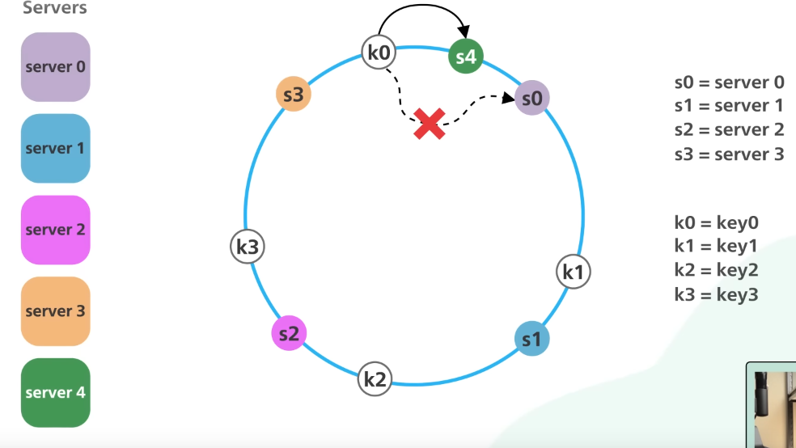

# learning_resources

- [Backend Interview process & questions at a startup](C%23_Backend_interview_process.md)
- [Datastructures and algorithms](README.md#datastructures-and-algorithms)
- [System design](README.md#system-design)

## Datastructures and algorithms

Implement your own datastructures in C#
- [Enumerable](datastructures/Enumerable.cs)
- [HashSet](datastructures/HashSet.cs)
- [Hashtable](datastructures/HashTable.cs)
- List
- Stacks
- Queues
- Linked List
- Tree
- Graph
- Heap


[bestresources](https://bestresources.co/resource/the-interview-study-guide-for-software-engineers-by-benjamin-rogojan--qvf019) - collected links about this DSA

<details>
    <summary>Tree Traversal recursive - DFS</summary>

```csharp
class Node {
    public int data;
    public Node left, right;
 
    public Node(int data)
    {
        data = data;
        left = right = null;
    }
}
 
public class BinaryTree {
    // Root of Binary Tree
    Node root;
 
    BinaryTree() { root = null; }
 
    /* Given a binary tree, print its nodes in inorder*/
    void printInorder(Node node)
    {
        if (node == null)
            return;
 
        /* first recur on left child */
        printInorder(node.left);
 
        /* process current node */
        Console.Write(node.data + " ");
 
        /* now recur on right child */
        printInorder(node.right);
    }
```

</details>

<details>
    <summary>Tree Traversal iterative - BFS</summary>

```csharp
public class Node {
    public int data;
    public Node left, right;
 
    public Node(int data)
    {
        data = data;
        left = null;
        right = null;
    }
}

public class BinaryTree {
    Node root;

    void printLevelOrder()
    {
        Queue<Node> queue = new Queue<Node>();
        queue.Enqueue(root);
        while (queue.Count != 0) {
 
            //Process node
            Node tempNode = queue.Dequeue();
            Console.Write(tempNode.data + " ");
 
            /*Enqueue left child */
            if (tempNode.left != null) {
                queue.Enqueue(tempNode.left);
            }
 
            /*Enqueue right child */
            if (tempNode.right != null) {
                queue.Enqueue(tempNode.right);
            }
        }
    }
}
```

</details>

<br>

[Sytem design primer](https://github.com/donnemartin/system-design-primer#study-guide) - start here

Definately watch the first video CS 75 from Harvard, it is a good basis for future knowledge and it is presented incrementally as a story, so its built up. Pretty great stuff.

Great resource - [github](https://github.com/systemdesignfightclub/SDFC/), [youtube](https://www.youtube.com/@SDFC/featured)

# Definitions

__Consistency:__ Consistency is the degree to which data is the same across different parts of a system. In a consistent system, all nodes have the same data at the same time. Consistency can be achieved by using distributed databases, implementing consensus algorithms, and using version control. For example, a consistent messaging system should ensure that all users see the same messages in the same order, regardless of which server they are connected to.

__Availability:__ Availability is the measure of how often a system is accessible and usable. High availability means that a system is available most of the time, with minimal downtime. For example, a highly available cloud storage service should be accessible to users at all times, even if some servers fail or undergo maintenance.

__Reliability:__ Reliability is the measure of how often a system functions as expected without failures or errors. A reliable system should be able to recover from failures and maintain data integrity. For example, a reliable banking system should not lose or corrupt customer data, and should be able to recover from hardware failures or network outages.

__Scalability:__ Scalability refers to the ability of a system to handle increasing amounts of load or traffic by adding more resources. A scalable system can handle more users, more data, and more requests without significant performance degradation. For example, a scalable e-commerce website should be able to handle a sudden surge in traffic during a flash sale without crashing or becoming slow.

__Latency:__ Latency is the time it takes for a system to respond to a request. Low latency is important for real-time systems, such as online games, video streaming, and financial trading platforms. For example, a low-latency trading platform should be able to execute trades quickly, in order to take advantage of market opportunities.

__Throughput:__ Throughput is the number of requests a system can handle in a given amount of time. High throughput is important for systems that need to process large amounts of data, such as databases, data warehouses, and big data analytics platforms. For example, a high-throughput data processing system should be able to analyze large volumes of data quickly, in order to generate insights for businesses.


# Concepts 

## CAP-theorem (Consistensy, Availability, Partition tolerance)
- Centralized system: you don't have to choose between __Availability__ and __Consistency__ because there is not network partition.
- Distributed system: Since partition is guaranteed you always have to choose between __Availability__ and __Consistency__. 

__Consistency:__ A read is guaranteed to return the most recent write for a given client. <br>

"Weak consistency," "eventual consistency," and "strong consistency" are different levels of consistency models that describe how data is synchronized and replicated in distributed systems. Here's a brief explanation of each:
- __Weak Consistency:__ In a weak consistency model, there is no immediate guarantee that all replicas of data will have the same value or be up to date. Updates to data are asynchronously propagated to different replicas, and clients may observe different versions of data depending on their access point. Weak consistency allows for high availability and low latency but sacrifices data consistency. It is often seen in systems like NoSQL databases, where scalability and partition tolerance are prioritized over strong consistency. <br>
- __Eventual Consistency:__ Eventual consistency is a relaxed consistency model where data replicas eventually converge and reach a consistent state over time, given that there are no further updates. In other words, if no new updates are made, eventually all replicas will agree on the same value. However, during periods of updates and replication, different replicas may temporarily have inconsistent values. Eventual consistency strikes a balance between availability and consistency and is commonly used in distributed systems such as distributed databases and content delivery networks (CDNs).
- __Strong Consistency:__ Strong consistency provides a strict guarantee that all replicas of data will have the same value and be up to date at all times. When a write/update operation completes, all subsequent read operations will return the updated value from any replica. Strong consistency ensures that the system behaves as if it were a single coherent entity, maintaining data integrity and consistency. However, achieving strong consistency often comes at the expense of increased latency and decreased availability, as the system must synchronize and coordinate updates across replicas. Traditional relational databases often provide strong consistency.


__Availability:__ A non-failing node will return a reasonable response within a reasonable amount of time (no error or timeout). <br>
- __Master-Slave Failover:__
In a master-slave failover configuration, there is one primary/master node and one or more secondary/slave nodes. The primary/master node is responsible for handling both read and write operations, while the secondary/slave nodes replicate data from the primary and handle only read operations. The primary node is the authoritative source of data, and the secondary nodes act as backups.<br>
Master-slave failover is commonly used in scenarios where read scalability, data backup, and fault tolerance are important. It is often seen in databases, such as MySQL with a primary-master replication setup.
- __Master-Master Failover:__
In a master-master failover configuration, there are multiple nodes, each serving as a master. Unlike the master-slave configuration, all nodes in a master-master setup can handle both read and write operations. Each master node is responsible for its subset of data or a specific partition.<br>
Master-master failover is commonly used in scenarios where high availability, load balancing, and fault tolerance are crucial. It is often seen in distributed databases, such as Apache Cassandra and Riak.

__Partition tolerance:__ The system will continue to function when network partitions occur.

__CP: Consistency/Partition Tolerance__ - In the context of the CAP theorem, the CP model emphasizes consistency and partition tolerance. It means that in the event of a network partition (where nodes in a distributed system are unable to communicate with each other), the system will prioritize maintaining strong consistency. This means that during a partition, some nodes may become unavailable to ensure data consistency across the system. Once the partition is resolved, the system resumes normal operation.

__AP: Availability/Partition Tolerance__ - In the AP model, the focus is on availability and partition tolerance. It means that the system will prioritize remaining available and accessible to users, even in the presence of network partitions. In this model, there may be temporary inconsistencies or divergent states across different replicas of data. The system allows for eventual consistency, ensuring that all replicas converge to a consistent state over time.

## __Caching__ 
[Video](https://www.youtube.com/watch?v=dGAgxozNWFE)

Storing frequently accessed data in a cache to reduce the number of requests made to a server. Caching can be done at various levels such as browser cache, CDN cache, and server cache.

Caching is a common technique  in modern computing to enhance  
system performance and reduce response time.
From the front end to the back end,  
caching plays a crucial role in improving the  efficiency of various applications and systems.
A typical system architecture  involves several layers of caching.
At each layer, there are multiple  strategies and mechanisms for caching data, depending on the requirements and  constraints of the specific application.
Before diving into a typical system architecture,  
let’s zoom in and look at how prevalent  caching is within each computer itself.

1. __At the computer level__<br>
The most common hardware cache  are L1, L2, and L3 caches. <br>
__L1 cache__ is the smallest and fastest cache,  typically integrated into the CPU itself. It stores frequently accessed data  and instructions, allowing the CPU to quickly access them without having  to fetch them from slower memory.<br>
__L2 cache__ is larger but slower than L1 cache,  
and is typically located on the  CPU die or on a separate chip.<br>
__L3 cache__ is even larger and slower than L2 cache,  and is often shared between multiple CPU cores. <br>
__Translation lookaside buffer (TLB)__ It stores recently used  virtual-to-physical address translations. It is used by the CPU to quickly  translate virtual memory addresses to physical memory addresses, reducing the  time needed to access data from memory.

                    TLB (Translation lookaside buffer)
                        -----------------------------|
        Virtual address |  Virtual    |   Physical   |
        --------------> |-------------|--------------| 
                        | 0x0000      | 0x0003       |
                        |-------------|--------------|
        Physical adress |0x0001       | 0x0004       |
        <---------------|-------------|--------------|
                        |0x0002       | 0x0005       |
                        |------------ |--------------| 
                        |0x0003       | 0x0011       |
                        ------------------------------

2. __At the operating system level__ (Page cache and other file system caches)<br>
__Page cache__ is managed by the operating  system and resides in main memory. It is used to store recently  used disk blocks in memory. When a program requests data from the disk,  
the operating system can quickly retrieve the  data from memory instead of reading it from disk.<br>
There are other caches managed by the  operating system, such as the __inode cache__. These caches are used to speed up  file system operations by reducing the number of disk accesses required  to access files and directories.

3. __Application front end__  
__Web browsers__ can cache HTTP responses  to enable faster retrieval of data.
When we request data over HTTP for the first time,  
and it is returned with an  expiration policy in the HTTP header;
we request the same data again, and the browser  returns the data from its cache if available.

4. __Content Delivery Networks (CDNs)__ are widely  used to improve the delivery of static content, such as images, videos, and other web assets. One of the ways that CDNs speeds up  content delivery is through caching. When a user requests content from a CDN,  
the CDN network looks for the  requested content in its cache.
If the content is not already in the cache, the CDN fetches it from the origin  server and caches it on its edge servers.
When another user requests the same content,  the CDN can deliver the content directly from its cache, eliminating the need to  fetch it from the origin server again.

5. __Some load balancers__ can cache resources  to reduce the load on back-end servers. When a user requests content from  a server behind a load balancer, the load balancer can cache the response and  serve it directly to future users who request the same content. This can improve response  times and reduce the load on back-end servers.
Caching does not always have to be in  memory. 

6. __In the messaging infrastructure__, message brokers such as Kafka can cache  a massive amount of messages on disk. This allows consumers to retrieve  the messages at their own pace. The messages can be cached for a long period  of time based on the retention policy.

7. __Distributed caches__ such as Redis  can store key-value pairs in memory, providing high read/write performance  compared to traditional databases 

8. __Full-text search engines__ like Elastic  Search can index data for document  search and log search, providing quick  and efficient access to specific data.

9. __Even within the database__, there are  multiple levels of caching available. Data is typically written to a write-ahead  log (WAL) before being indexed in a B-tree. The buffer pool is a memory area  used to cache query results, while materialized views can precompute  query results for faster performance. The transaction log records all  transactions and updates to the database,
while the replication log tracks the  replication state in a database cluster.

10. __Caching at an object level__, you can cache objects in your application for faster retrieval. See your data as an object, similar to what you do with your application code. Have your application assemble the dataset from the database into a class sinstance or a data structure(s):<br> - Remove the object from cache if its underlying data has changed


Overall, caching data is an essential  technique for optimizing system performance and reducing response time. From  the front end to the back end,  there are many layers of caching to improve the  efficiency of various applications and systems.

### When to update the cache
#### Cache-aside

- Look for entry in cache, resulting in a cache miss
- Load entry from the database
- Add entry to cache
- Return entry

``` python
def get_user(self, user_id):
    user = cache.get("user.{0}", user_id)
    if user is None:
        user = db.query("SELECT * FROM users WHERE user_id = {0}", user_id)
        if user is not None:
            key = "user.{0}".format(user_id)
            cache.set(key, json.dumps(user))
    return user
```
Subsequent reads of data added to cache are fast. Cache-aside is also referred to as lazy loading. Only requested data is cached, which avoids filling up the cache with data that isn't requested.

<br>

#### Write-through
The application uses the cache as the main data store, reading and writing data to it, while the cache is responsible for reading and writing to the database:

- Application adds/updates entry in cache
- Cache synchronously writes entry to data store
- Return

Application code:

    set_user(12345, {"foo":"bar"})

Cache code:

``` python
def set_user(user_id, values):
    user = db.query("UPDATE Users WHERE id = {0}", user_id, values)
    cache.set(user_id, user)
```

Write-through is a slow overall operation due to the write operation, but subsequent reads of just written data are fast. Users are generally more tolerant of latency when updating data than reading data. Data in the cache is not stale.

<br>

#### Write-behind (write-back)


User --> Write to cache --> Queue --> Event processor --> DB

In write-behind, the application does the following:

- Add/update entry in cache
- Asynchronously write entry to the data store, improving write performance

<br>

## Consistent hashing
[video](https://www.youtube.com/watch?v=UF9Iqmg94tk)

Real life examples <br>
Dynamo Db
Apache cassandra -> Data partitioning

Content deliverz networks -> Distribute web content evenly
Load balancers -> Distribute persistent connections evenly

Simple hasing
Number of nodes (computers, servers, buckets etc) = n <br>
hashFunction(objectKey) % n <br>
Problem with simple hasing is when the number of nodes change. The data has to be rebalanced,
we have to move __all the data__.

Consistent hashing - image
Accpeting that the number of nodes change, we not only hash the object keys, but
the server names as well. This creates a ring of hashes, which will
help us find the node for the object we are looking up. <br>
This way we don't have to move all the data, just data from one server.
Even this could be a lot therefore problematic. So we create virtual nodes
out of our nodes, and alternating them on the hash ring we ensure
that the data that'll have to be moved is minimized.



                In this image only k0 keys have to be moved

## ACID (SQL)
hese properties are crucial for applications that require strict data consistency and reliability, such as financial systems, e-commerce platforms, SQL databases and critical enterprise systems.
1. __Atomicity:__ Atomicity guarantees that a transaction is treated as a single indivisible unit of work. It means that either all the __changes made within a transaction are successfully committed, or none of them are__. If any part of the transaction fails, all changes are rolled back to the original state.

    - Example: Consider a banking application where a customer transfers money from one account to another. The transaction includes debiting the sender's account and crediting the recipient's account. Atomicity ensures that if either the debit or the credit operation fails, the entire transaction is rolled back, leaving both accounts unaffected.
    Isolation:
    Isolation ensures that concurrent execution of transactions does not produce unexpected or incorrect results. Each transaction appears to execute in isolation, without interference from other concurrent transactions. It prevents data inconsistencies caused by concurrent access to shared data.

<br>


2. __Consistency:__ Consistency ensures that a transaction __brings the database from one valid state to another.__ It maintains data integrity by enforcing integrity constraints, rules, and relationships defined in the database schema.

    - Example: Suppose you have a database table where the age of a person should always be a positive value. If a transaction attempts to update a person's age to a negative value, the consistency property ensures that the transaction is rejected, and the database remains in a valid and consistent state.

<br>

3. __Isolation:__ Isolation ensures that concurrent execution of transactions does not produce unexpected or incorrect results. Each transaction appears to __execute in isolation, without interference from other concurrent transactions.__ It prevents data inconsistencies caused by concurrent access to shared data.

    - Example: If two users simultaneously withdraw money from the same account, isolation ensures that their transactions do not interfere with each other. Each transaction reads the initial balance, performs the withdrawal, and updates the balance independently, preserving data consistency.

<br>

4. __Durability:__ Durability guarantees that once a __transaction is committed, its changes are permanent and will survive any subsequent system failures__, such as power outages or crashes. The committed data is stored safely and can be retrieved even in the presence of failures.

    - Example: When a transaction is committed in a database, the changes made during that transaction are durably stored on disk or other persistent storage media. Even if there is a system failure immediately after the commit, the changes are not lost and can be recovered when the system restarts.

Wikipedia on ACID <br>
> A database transaction symbolizes a unit of work, performed within a database management system (or similar system) against a database, that is treated in a coherent and reliable way independent of other transactions. __A transaction generally represents any change in a database.__ Transactions in a database environment have two main purposes:  
>- To provide reliable units of work that __allow correct recovery from failures and keep a database consistent even in cases of system failure.__ For example: when execution prematurely and unexpectedly stops (completely or partially) in which case many operations upon a database remain uncompleted, with unclear status.
> - To provide __isolation between programs accessing a database concurrently.__ If this isolation is not provided, the programs' outcomes are possibly erroneous.

> In a database management system, a transaction is a single unit of logic or work, sometimes made up of multiple operations. Any logical calculation done in a consistent mode in a database is known as a transaction. One example is a transfer from one bank account to another: the complete transaction requires subtracting the amount to be transferred from one account and adding that same amount to the other. <br>

> A database transaction, by definition, must be atomic (it must either be complete in its entirety or have no effect whatsoever), consistent (it must conform to existing constraints in the database), isolated (it must not affect other transactions) and durable (it must get written to persistent storage).[1] Database practitioners often refer to these properties of database transactions using the acronym ACID.*

<br>

## BASE
It represents an alternative approach to system design that relaxes some of the strict consistency guarantees provided by the ACID properties. BASE is often used in distributed systems, particularly in scenarios where high availability and scalability are prioritized over strong consistency.

1. __Basically Available:__ Basically Available means that the system remains operational and responsive to user requests even in the face of failures or partial outages. It focuses on providing a working system that continues to function, albeit potentially with reduced functionality or performance.
    - Example: Consider an e-commerce website that experiences a database failure. In a basically available system, the website might still be accessible to users, allowing them to browse and add items to their carts. However, certain features like checking out or updating user profiles may be temporarily disabled until the database issue is resolved.

2. __Soft State:__ Soft State refers to the idea that the system's state can change over time even in the absence of input or activity. The system allows for eventual consistency, where the state of the system may vary between different nodes or replicas, and the system tolerates temporary inconsistencies.
    - Example: In a distributed caching system, when data is updated in one node, it may take some time for the update to propagate to all other nodes due to network delays or replication mechanisms. During this period, different nodes may have slightly different versions of the data, resulting in a soft state. Eventually, the system converges to a consistent state as updates propagate and reach all nodes.

3. __Eventually Consistent:__ Eventually Consistent means that the system will reach a consistent state over time. It acknowledges that achieving strong consistency across all nodes in a distributed system may be challenging or impractical, especially in large-scale or geographically distributed environments. Instead, the focus is on ensuring that the system converges to a consistent state in the long run.
    - Example: In a distributed NoSQL database, if multiple replicas receive concurrent updates, the system may allow temporary inconsistencies across replicas. However, over time, through mechanisms like conflict resolution or background synchronization, the replicas will converge to a consistent state.

BASE provides an alternative approach to system design, trading off strict consistency guarantees for improved availability, scalability, and partition tolerance. It is often employed in systems like large-scale web applications, content delivery networks (CDNs), or distributed databases where maintaining high availability and handling large volumes of data are critical.

## Event sourcing - Streaming
[difference](https://www.youtube.com/watch?v=I3Mlt7GCeIU) - 
[event streaming](https://www.youtube.com/watch?v=7Bh10yAycws)


# Real world architectures

## MapReduce 

[at Google in 2004 by Jeffrey Dean and Sanjay Ghemawat] <br> [article](http://static.googleusercontent.com/media/research.google.com/zh-CN/us/archive/mapreduce-osdi04.pdf), [video 1](https://www.youtube.com/watch?v=cHGaQz0E7AU), [video 2](https://www.youtube.com/watch?v=cvhKoniK5Uo)

- What is MapReduce?
- What is the basic architecture? - image
- What filesystem is required?
- What kind of problems does it solve? Give me 2 examples.

<br>

## Hadoop file system 

[article](https://hadoop.apache.org/docs/r1.2.1/hdfs_design.pdf) - a very good article by Apache

[video](https://www.youtube.com/watch?v=nRX4_3qf3rc)
- What is HDFS?
- What is the diff between a normal file system and hdfs?
- what problem does it solve?
- What is the NameNode, what does it do, how many instances are there?
- What is the DataNode, what does it do, how many instances are there? 
- What is the FileSystem Namespace and who is responsible for maintaining it?
- What are EditLog and FsImage?

### Replica Placement
One third of replicas are on one
node, two thirds of replicas are on one rack, and the other third are evenly distributed across the remaining racks. This policy improves write performance without compromising data reliability or read performance.

            RACK 1                          RACK 2
            ---------------                 ---------------
            |  Node 1     |                 | Node 4      |
            |             |                 |             |
            |  FILE_ID1   |                 |  FILE_ID1   |
            |  BLOCK_ID1  |                 |  BLOCK_ID2  |
            |-------------|                 |-------------|
            |             |                 |             |
            |  Node 2     |                 |  Node 5     |
            |             |                 |             |
            |------------ |                 |-------------|
            |             |                 |  Node 6     |
            |  Node 3     |                 |             |
            |             |                 |  FILE_ID1   |
            |             |                 |  BLOCK_ID3  |
            ---------------                 ---------------

# Architectural patterns

## __CQRS (Command Query Responsibility Segregation)__ 

CQRS is a software architectural pattern that separates the responsibilities of handling commands (write operations that modify the system state) and queries (read operations that retrieve data). It recognizes that the requirements for reading data from a system are often different from those for modifying data, and tailors the design of each aspect accordingly.

In a CQRS architecture, the system is divided into two parts:

- __Command Side:__
The command side of the system handles operations that modify the state. It accepts commands or requests for changes, processes them, and updates the state accordingly. The command side is responsible for enforcing business rules, validating input, and persisting the changes.
- __Query Side:__
The query side of the system focuses on retrieving data and serving read requests. It maintains a separate read model optimized for querying and fetching data. The read model is denormalized and structured to efficiently serve specific queries, ensuring high performance for read operations.

In this example, CQRS allows the system to optimize write operations (commands) separately from read operations (queries). The command side handles the complex business logic of fund transfers, ensuring data integrity and enforcing business rules. The query side provides fast and efficient read access to the denormalized account balance data, enhancing the performance and scalability of the read operations.

By decoupling the command and query responsibilities, CQRS enables scalability, flexibility, and improved performance in systems with distinct requirements for read and write operations. It allows for independent scaling of the command and query sides, as well as tailored optimization strategies for each aspect of the system.

# Videos
1. [8 design patterns](https://www.youtube.com/watch?v=tAuRQs_d9F8) every developer should know

1. 10 [System design concepts](https://www.youtube.com/watch?v=i53Gi_K3o7I) explained consisely

1. What is the difference between a [process and a thread](https://www.youtube.com/watch?v=4rLW7zg21gI&list=PLCRMIe5FDPseVvwzRiCQBmNOVUIZSSkP8&index=8)?

2. What is [HTTPS and TLS](https://www.youtube.com/watch?v=j9QmMEWmcfo&list=PLCRMIe5FDPseVvwzRiCQBmNOVUIZSSkP8&index=9)?

3. [What happens](https://www.youtube.com/watch?v=AlkDbnbv7dk&list=PLCRMIe5FDPseVvwzRiCQBmNOVUIZSSkP8&index=10) when you type a URL into your browser?

<br>


## Design tinyUrl / bit.ly
Solution - [youtube](https://www.youtube.com/watch?v=tm-SWO9gUAU)

Task:
